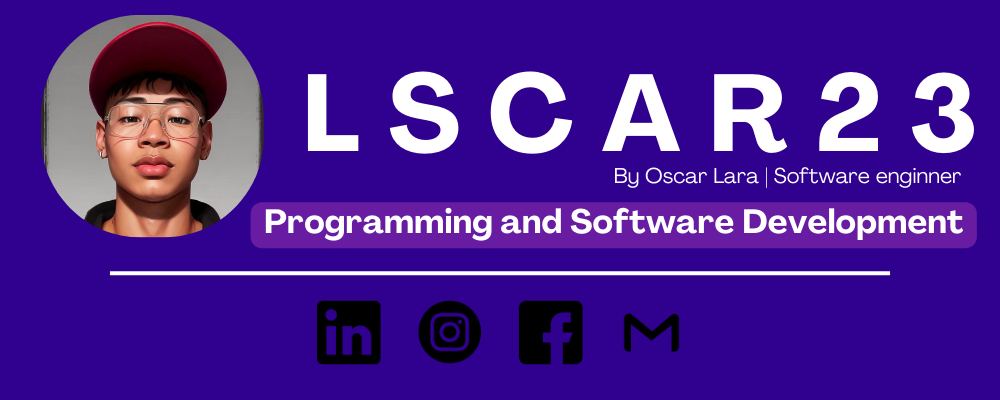

    
    <strong style="font-size: 36px;">Hola, mi nombre es Oscar Lara</strong> 

    Soy ingeniero de software.

    Mi experiencia profesional se ha desarrollado en su mayoría de manera independiente, trabajando como freelance y llevando adelante diversos proyectos personales. Algunos de estos proyectos están disponibles públicamente en mi <a href="https://github.com/LSCAR23" target="_blank">GitHub</a>, donde comparto mi progreso y las habilidades que he adquirido a lo largo del tiempo. En 2024, me gradué en Ingeniería en Software de la Universidad Técnica Nacional en Costa Rica, y actualmente continúo mis estudios para alcanzar el nivel de Bachillerato en esta misma carrera.

    Más allá de mi formación académica, me esfuerzo diariamente por explorar nuevas tecnologías y tendencias en desarrollo de software. Dedico tiempo a aprender lenguajes de programación modernos, frameworks, y prácticas avanzadas que optimizan la eficiencia y la calidad de los proyectos en los que trabajo. Esto me permite mejorar continuamente mis habilidades como desarrollador, mantenerme actualizado con las demandas del sector tecnológico, y ofrecer soluciones innovadoras y efectivas en cada proyecto.

<h2>Encuéntrame en:</h2>

    
    
    
    
    

